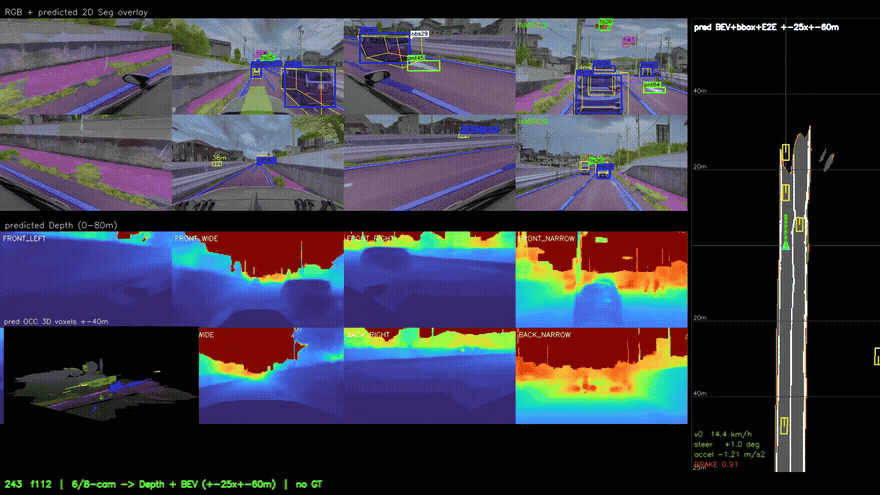
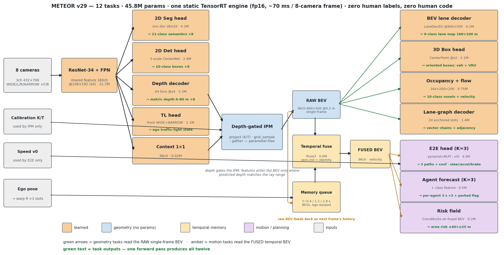
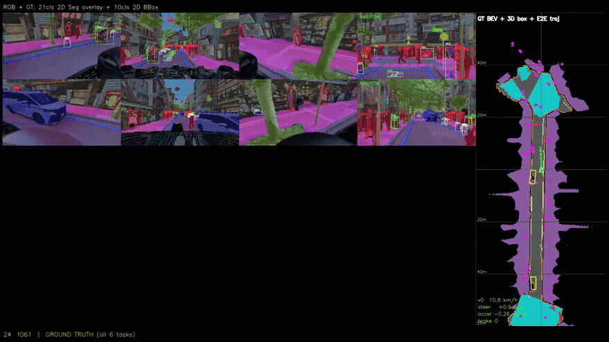
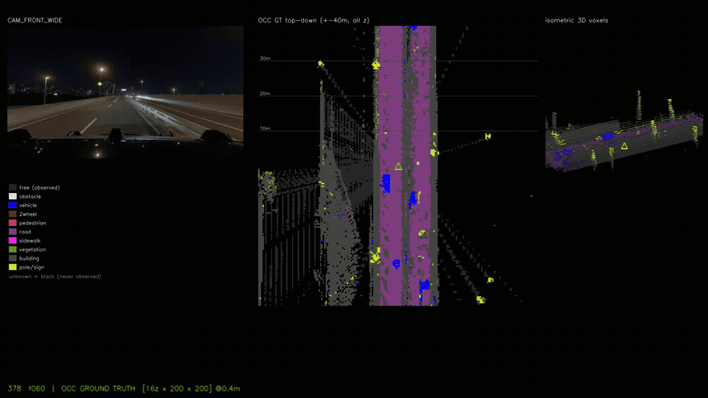
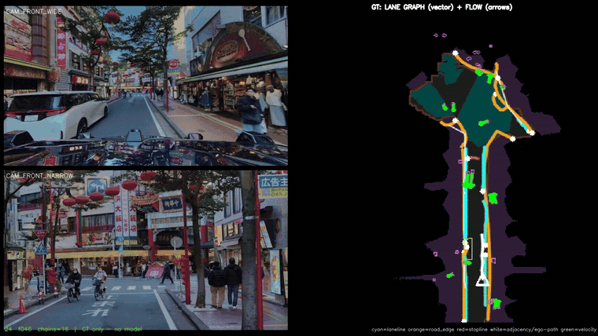
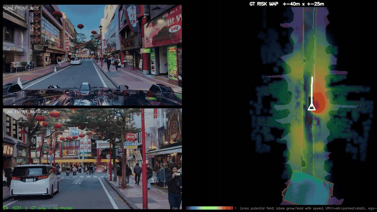

<div align="center">

# ☄️ METEOR

### **M**ulti-task **E**stimation of **T**raffic **E**lements, **O**bjects & **R**oads

*Eight cameras (Co-MLOps DRS). One network. Twelve driving tasks — streaming temporal BEV, multimodal E2E. Camera-only at inference; LiDAR is an **optional** input on the same weights.*

**Zero human labels. Zero human-written code.**

[-orange)](https://co-mlops.tier4.jp/)
[](https://www.nvidia.com/ja-jp/gtc/session-catalog/sessions/gtc26-s81897/)
[]()
[]()
[]()
[]()
[]()
[]()
[]()
[]()



*Live inference (v29) — 8 DRS cameras in, everything out: 2D segmentation, 2D & 3D
detection with parked/stopped flags, metric depth, BEV lane map, 3D occupancy, the
ego-relevant traffic-light state, a continuous near-range risk field, and multimodal
end-to-end driving (3 path hypotheses + confidences).*

</div>

---

## What is METEOR?

METEOR is a **surround-view multi-task network** for autonomous driving: it consumes
the **8 cameras of the [Co-MLOps](https://co-mlops.tier4.jp/) Data Recording System (DRS)** — camera-only
at inference, with **LiDAR as an optional extra input on the very same weights**
(v31: feed points for extra precision, feed zeros to run camera-only; the two
modes are bit-identical when LiDAR is absent) — and is trained **entirely on
auto-generated ground truth, zero human annotation** (LiDAR is used offline by
the label factory, and optionally online as that extra input).

It is built on **CoMET — the autolabeling foundation of the [Co-MLOps](https://co-mlops.tier4.jp/) project**:
CoMET's LiDAR × panoptic × ego-pose autolabels are distilled into every one of
METEOR's supervision signals. The pipeline in this repository extends the
CoMET foundation from BEV lane maps to depth, 2D/3D detection, occupancy and
end-to-end driving targets — turning raw t4dataset-format recordings into a
complete multi-task training set with no labeling cost. CoMET made the labels;
METEOR is what the labels can train.

From **8 cameras (768×432) + calibration + current speed**, a single forward pass predicts:

| # | Task | Output |
|---|------|--------|
| 1 | **BEV lane segmentation** | 9 classes, 160 × 100 m @ 0.2 m |
| 2 | **Metric depth** | 64 bins × 8 cams @ stride 4 |
| 3 | **3D oriented boxes** | CenterPoint-style, vehicles + VRU |
| 4 | **Unknown-object detection** | cones / posts / debris as fixed-size 3D boxes — a class the annotation set does not even contain (GT invented from occupancy blobs) |
| 5 | **2D semantic segmentation** | 21 classes (Cityscapes-like palette) |
| 6 | **2D detection** | 10 classes, YOLO-style 3-scale |
| 7 | **Multimodal E2E driving** | K=3 path hypotheses (3 s) + confidences + steering / accel / brake |
| 8 | **3D semantic occupancy** | 10 classes, 16 × 200 × 200 voxels @ 0.4 m |
| 9 | **Occupancy flow** | per-cell BEV velocity field |
| 10 | **Agent forecasting + parked/stopped flag** | class-aware 3 s future per detected agent, one-shot |
| 11 | **Traffic-light state** | ego-relevant state (none / green / red) |
| 12 | **Area risk field + vector lane graph** | continuous near-range hazard map; polyline lane graph with adjacency |

All heads share one ResNet-34 + FPN image backbone and one **depth-gated IPM** BEV
representation — adding a task costs **< 5 %** of total compute. Since v29 the BEV is
**temporal with a 3-slot memory queue** (t−0.4 / −1.2 / −2.8 s): history BEVs are
ego-motion-warped and fused in a streaming, TensorRT-safe recurrence. Geometry tasks
(lanes / 3D boxes / occupancy) read the RAW single-frame BEV; motion tasks (E2E,
forecasting, flow) read the FUSED temporal BEV — task-routed to keep static geometry
free of moving-object ghosts. The forecasting head additionally reads an explicit
**motion residual** (current BEV minus the warped t−0.4 s slot) so oncoming traffic
keeps its true heading.

### Optional LiDAR input — one set of weights, two sensor configs (v31)

LiDAR points, projected to the cameras as a sparse depth map, **sharpen the
predicted depth distribution** where returns exist (`dprob' = (1−α·m)·dprob +
α·m·tri(d)`, elementwise only — TensorRT-safe, ~zero runtime cost). Feeding
zeros is **bit-identical to the camera-only network**, so a single checkpoint /
single engine serves both sensor configurations; training hides the LiDAR on
half the samples (modality dropout) so both modes stay calibrated — and the
LiDAR-assisted gradients improve the camera-only model too.

> ### 🚀 Have Co-MLOps data? You can build this.
> Everything here needs nothing but **raw [Co-MLOps](https://co-mlops.tier4.jp/) DRS recordings** (t4dataset
> format). No annotation team, no labeling budget, no hand-written code:
> point the autolabel factory at your scenes, run the trainer, and you get a
> 12-task driving model — **from raw logs to a trained network in three
> commands** (see [Quickstart](#quickstart)).

## Fully automated, end to end

This project is an experiment in **full automation of an ML system** — both of
its ingredients are machine-made:

- **No human labels.** Every supervision signal for all twelve tasks is
  distilled automatically from raw recordings by the CoMET-based autolabel
  factory. Nobody drew a box, a mask, or a trajectory.
- **No human-written code.** Every line in this repository — the models, the
  GT extractors, the trainer, the demo renderers, the docs, the architecture
  diagram, and this README — was written by **Claude (Fable 5, Anthropic)**
  operating autonomously: humans set the goals and reviewed the results; the
  agent designed, implemented, debugged, measured, and iterated. The rolling
  training rounds themselves (data refresh, relaunch, metric-driven loss
  fixes) run under the same agent loop.

## Architecture

<div align="center">

</div>

The signature block is the **depth-gated IPM**: BEV grid points are projected into every
camera (K/T), context features are `grid_sample`d, and each sample is **gated by the
predicted depth probability at its true range** — depth acts as a learned visibility valve
for the geometric projection. No transformers, no deformable attention:
`conv / grid_sample / gather / maxpool / MLP` only, so the whole network exports to
**TensorRT** as-is — see [deploy/](deploy/README.md) for the ONNX export + streaming TensorRT runtime. Details in [docs/ARCHITECTURE.md](docs/ARCHITECTURE.md).

## The autolabel factory (powered by CoMET / [Co-MLOps](https://co-mlops.tier4.jp/))

Every supervision signal is distilled offline from raw recordings — LiDAR, ego-pose,
2D panoptic masks and TLR autolabels — by a **17-stage**, per-scene resumable pipeline
built on the **CoMET autolabeling foundation from the Co-MLOps project**:

<div align="center">


*Auto-generated GT: 21-class 2D seg + 10-class 2D boxes + BEV lanes + oriented
3D boxes + per-agent 3 s futures + E2E trajectory (green) with speed / steering /
accel / brake.*



*3D occupancy GT: accumulated labeled LiDAR, voxelized with ray-carved free space —
top-down and isometric views.*



*Vector lane-graph GT (cyan lane lines, orange road edges, red stop lines, white
adjacency links) + occupancy-flow GT (green velocity arrows) + the ego path — all
derived from the same autolabels, no extra annotation.*



*Near-range area risk field: each agent contributes an anisotropic lobe that grows and
leads with its GT speed, statics contribute a distance falloff, and the lobes combine
saturatingly — a continuous hazard map with zero human input.*

</div>

Highlights (full recipe in [docs/DATA_PIPELINE.md](docs/DATA_PIPELINE.md)):

- **BEV lanes** — LiDAR × panoptic accumulation in the map frame, vectorized into
  connected polylines, re-rendered with hole-filling and an ego-connected drivable filter.
- **Depth** — LiDAR splats + road-merged linear interpolation + geometric ground fill.
- **3D boxes** — LiDAR annotations kept only when geometrically confirmed by a camera.
- **E2E** — future ego-pose → trajectory; bicycle-model steering; accel / brake from
  smoothed speed (no CAN required).
- **Occupancy** — multi-sweep labeled LiDAR voxelization, dynamic-object de-smearing,
  0.4 m ray-stepped free-space carving.
- **Quality gates** — scene-end trimming, stationary-spot exclusion, GT-coverage filters,
  intersection guards.

## Data augmentation & sampling

Photometric only, geometric never — the depth-gated IPM depends on exact
camera calibration, so image-space flips/crops/rotations would silently
break the camera-to-BEV correspondence. Each camera draws independently
(`--aug`):

| Augmentation | Range / rate | Purpose |
|---|---|---|
| Camera dropout | 1 of 6 surround cams zeroed, 15 % of samples | sensor-failure robustness |
| Brightness scale | x U(0.7, 1.3) | exposure variation |
| Brightness offset | + U(-0.08, 0.08) | black-level variation |
| Contrast scale | x U(0.8, 1.25) around the mean | weather / lens flare |
| Pixel noise | Gaussian sigma = 0.012 | sensor noise |
| LiDAR modality dropout (v31+) | whole-sample, 50 % | one set of weights serves camera-only AND LiDAR-assisted inference |

Independent per-camera draws double as cross-camera photometric
inconsistency training. The temporal memory also sees naturally missing
history slots (2.5-9 % of frames), which acts as temporal dropout.

Distribution shaping happens at the sampler instead of the pixel level:
a fresh random subset is drawn every epoch (full-corpus coverage across a
round), turning frames (|lat@3s| > 4 m) are oversampled 3x, and the scenes
the previous round was worst at (auto-mined, C2) are oversampled 2x.

## Results (validation, unseen recording)

| Metric | Value |
|---|---|
| BEV lane mIoU | **0.302** |
| 2D seg mIoU (21 cls) | **0.535** |
| 3D det vehicles (precision / near-corridor recall) | **0.85 / 0.72** |
| 3D det yaw (axis error / direction flips) | **5.8° / 10 %** |
| 3D det VRU (precision / near-corridor recall) | **0.73 / 0.44** |
| E2E trajectory ADE / ADEc / FDE (3 s) | **0.73 m / 0.72 m / 1.54 m** |
| Traffic-light state accuracy | **0.86** |
| Agent forecast ADE (3 s) | **1.92 m** |

(r22, held-out recording day.) Trained on **2,800+ scenes / two vehicle platforms**,
list growing continuously as the autolabel factory converts more recordings (rolling
training rounds; r23 = v31 with the optional-LiDAR input is training now). Trained on
Japan-only data, the same engine runs **zero-shot on US recordings** (right-hand
traffic, different vehicles, 114 km/h highways) — the geometric projection does not
break when the country does.

## Quickstart

From raw Co-MLOps recordings to a trained 12-task model — three commands:

```bash
# 1) Convert raw scenes into training GT (11 stages, resumable, scene-parallel)
python3 bevlane/convert_dtset.py --scenes scene_list.txt --workers 12

# 2) Train the 12-task model (8 GPUs)
torchrun --nproc_per_node=8 bevlane/train.py \
  --model v31 --batch 2 --epochs 8 --workers 0 --lr 5e-5 --val-every 500 \
  --gt-key gt_vec --train-list scenes.txt --train-bg --aug --lidar-drop 0.5 \
  --seg-w 1.0 --dice-w .5 --lovasz-w .5 --boundary-w 3 --tversky-w .6 --far-w 1 \
  --depth-w 0.6 --box-w 1.2 --seg2d-w 0.35 --bbox2d-w 0.25 --ego-w 0.8 \
  --occ-w 0.4 --traj-w 0.5 --tl-w 0.6 --risk-w 0.3 --lanegraph-w 0.5 \
  --flow-w 0.3 --unk-w 0.5 --seg2d-key seg2d21 --n-seg2d 21 --out out/ckpt

# 3) Render the full multi-task demo video
python3 bevlane/demo_rgbd_bev.py --model v31 --n-seg2d 21 \
  --ckpt out/ckpt/best.pt --show-seg2d --scenes <SCENE ...> --out out/demo.mp4
# add --lidar to run the SAME checkpoint with the optional LiDAR input
```

More recipes: [docs/TRAINING.md](docs/TRAINING.md) · [docs/DEMO.md](docs/DEMO.md)

## Repository layout

```
bevlane/
  model.py             # model zoo v1..v31 (v31 = 12-task, memory queue, optional LiDAR)
  train.py             # DDP multi-task trainer + per-task val metrics
  dataset.py           # multi-task dataset (all GT modalities, ignore-safe)
  convert_dtset.py     # 11-stage per-scene GT factory driver
  extract_gt.py        # image cache + BEV lane GT crops
  render_vector_gt.py  # hybrid raster+vector lane GT (hole fill, guards)
  extract_depth_*.py   # dense metric depth GT (8 cams)
  extract_seg2d.py     # 21-class 2D seg GT (csv-driven taxonomy)
  extract_bbox2d.py    # 10-class 2D box GT (csv-driven taxonomy)
  extract_bev_box.py   # camera-confirmed 3D box GT
  extract_ego.py       # E2E GT from ego-pose (trajectory/steer/accel/brake)
  extract_occ.py       # 3D semantic occupancy GT
  extract_agent_traj.py# per-agent 3 s future GT (camera-confirmed instances)
  demo_rgbd_bev.py     # 12-task inference demo renderer (--lidar optional)
  demo_gt_full.py      # all-GT visualisation
  demo_occ_gt.py       # occupancy GT visualisation (top-down + isometric)
autolabel_bev.py       # LiDAR x panoptic BEV accumulation (map frame)
vectorize_bev.py       # raster -> connected polyline vector maps
run_batch.py           # scene-parallel autolabel production
deploy/
  export_onnx.py       # checkpoint -> static 18-output ONNX (parity-checked)
  runtime.py           # TensorRT streaming runtime (3-slot memory) + decoders
  infer_t4dataset.py   # raw t4dataset scene -> TRT inference -> npz + video
comlops-21cls-autolabel-2504.csv   # 2D seg taxonomy (id, name, colour)
fastlabel_2510_instance.csv        # 2D det taxonomy (id, name, colour)
docs/                  # architecture / data / training / demo docs
```

## Deployment: raw t4dataset → TensorRT, in one command

The whole 12-task network exports to a **single static ONNX graph** (18 outputs,
every one verified against PyTorch to ~1e-5) and builds with stock
`trtexec --fp16` on TensorRT 8.6 — **no plugins, no dynamic shapes**. The
streaming temporal memory is a **host-side recurrence**: the three history BEVs
and their warp matrices are engine inputs, `raw_bev` is an engine output that
the runtime rings back on the next frame.

```bash
# 1) checkpoint -> ONNX (parity-checked) -> fp16 engine
python3 deploy/export_onnx.py --ckpt ckpt.pt --out meteor_v29.onnx --check --fp16
trtexec --onnx=meteor_v29.onnx --saveEngine=meteor_v29_fp16.engine --fp16

# 2) run it straight on a raw t4dataset scene — no GT, no PyTorch
python3 deploy/infer_t4dataset.py --engine meteor_v29_fp16.engine \
        --scene /path/to/t4dataset/<scene> --out out/infer --video out/infer.mp4
```

`infer_t4dataset.py` reads `annotation/*.json` + `data/CAM_*` directly, rebuilds
the 8-camera tensor and calibration exactly as training does, derives ego speed
and pose from `ego_pose`, streams the temporal memory, and writes per-frame
`npz` (3D boxes with parked flags and speeds, lane map, K=3 ego paths with
confidences, traffic-light state, risk field, occupancy) plus an overlay video.

Measured: **~70 ms/frame** (fp16, all 8 cameras, all tasks, single engine —
on a GPU shared with a running training job, so a lower bound).

See [deploy/README.md](deploy/README.md). Pre-exported ONNX weights are attached
to [release tags](../../tags) — not tracked in the repo.

## Paper

**"METEOR: From Raw Surround-View Recordings to a Seven-Task Driving Network
without Human Labels or Human-Written Code"** — Dan Umeda.
[PDF](paper/main.pdf) · [LaTeX source](paper/main.tex) · [Talk slides](paper/METEOR_talk.pptx) · [Optimization log](out/METEOR_improvements.pptx)

## Documentation

| Doc | Contents |
|---|---|
| [ARCHITECTURE.md](docs/ARCHITECTURE.md) | stage-by-stage tensor shapes, params & FLOPs, depth-gated IPM |
| [DATA_PIPELINE.md](docs/DATA_PIPELINE.md) | the 10-stage autolabel factory, taxonomies, quality gates |
| [TRAINING.md](docs/TRAINING.md) | losses, curricula, rolling rounds, operational notes |
| [DEMO.md](docs/DEMO.md) | demo tooling and video layouts |
| [DESIGN_v29.md](docs/DESIGN_v29.md) | the v29 design: multimodal K=3, memory queue, lane graph, occupancy flow |
| [ROADMAP.md](docs/ROADMAP.md) | candidate list for future rounds: known defects, TRT-safe transformer options, capabilities |

---

<div align="center">
<sub>METEOR — because it came from CoMET. ☄️<br/>
Built on the CoMET autolabeling foundation of the <a href="https://co-mlops.tier4.jp/"><b>Co-MLOps</b></a> project
· presented at <a href="https://www.nvidia.com/ja-jp/gtc/session-catalog/sessions/gtc26-s81897/">NVIDIA GTC 2026 (S81897)</a>.<br/>
Labels by machines. Code by <b>Claude Fable 5</b>. Direction by humans.</sub>
</div>
