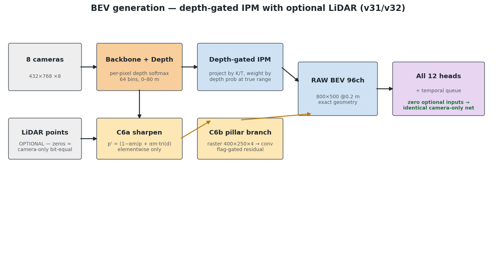
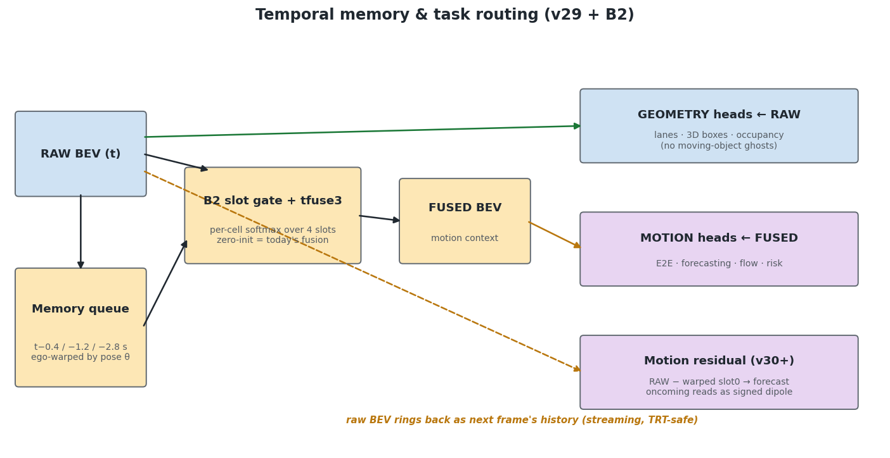
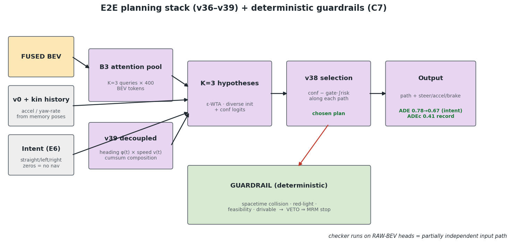
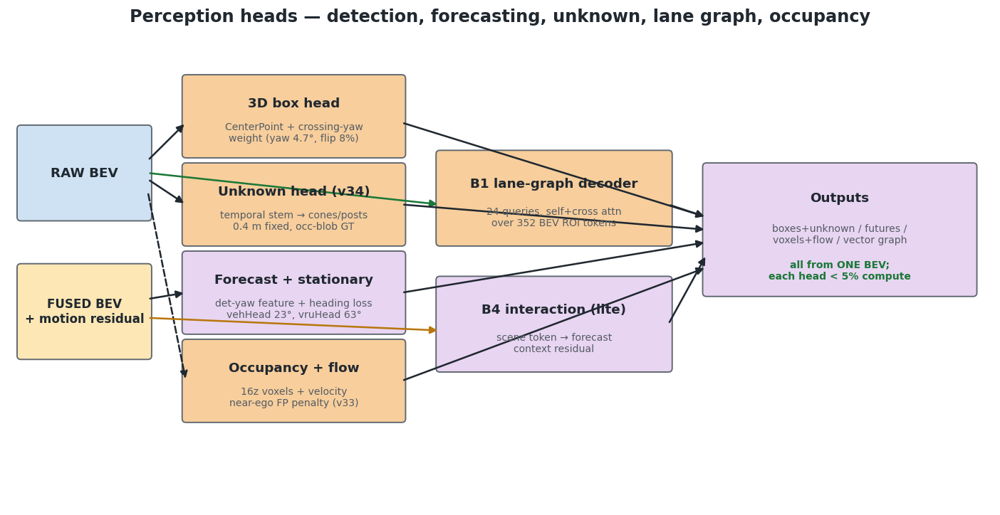
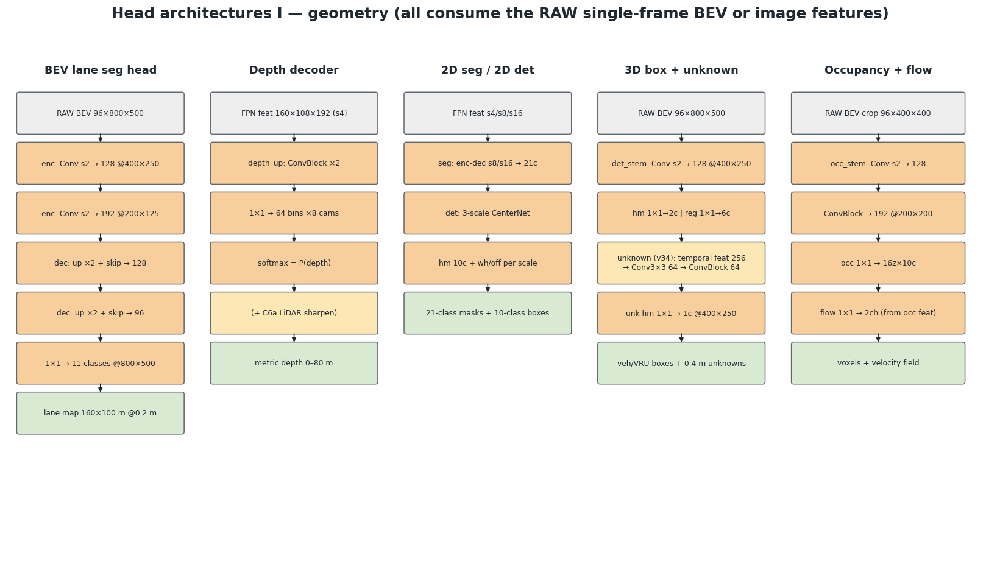
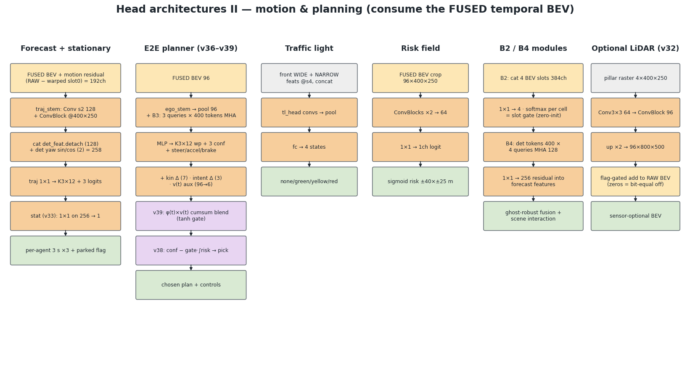

<div align="center">

# ☄️ METEOR

### **M**ulti-task **E**stimation of **T**raffic **E**lements, **O**bjects & **R**oads

*Eight cameras (Co-MLOps DRS). One 54M-parameter network. Twelve driving tasks —
running on a Jetson AGX Orin at ~15 FPS (67 ms INT8), with LiDAR as an optional extra input on the same engine.*

**Zero human labels. Zero human-written code. Multiple machines run by AI agents.**

[-orange)](https://co-mlops.tier4.jp/)
[](https://www.nvidia.com/ja-jp/gtc/session-catalog/sessions/gtc26-s81897/)
[]()
[-blue)]()
[_%7C_75.4_ms_(dense)-76B900)]()
[-informational)]()
[]()
[]()
[]()
[](LICENSE)


*The released model (v157, 2:4 sparse) on the published demo scenes — expressway, mountain
road, arterial, city — 8 anonymised DRS cameras in, everything out: 2D & 3D detection with
parked/stopped flags, metric depth, BEV lane map, the ego-relevant traffic-light state, a
near-range risk field, multimodal end-to-end driving (3 path hypotheses + confidences) under a
deterministic guardrail, and unknown obstacles lifted from 2D detections into BEV (white dots).
Full 88-second video: reproduce it with the commands in the Hugging Face section below.*

</div>

---

## What is METEOR?

METEOR is a **surround-view multi-task network** for autonomous driving. It consumes the
**8 cameras of the [Co-MLOps](https://co-mlops.tier4.jp/) Data Recording System (DRS)** plus
calibration and the current ego speed, and it is trained **entirely on auto-generated
ground truth** — the CoMET autolabel factory turns raw t4dataset recordings (LiDAR, ego
pose, panoptic masks) into every supervision signal. LiDAR is used offline by the label
factory and, optionally, online as an extra input on the very same weights.

From **8 cameras (768×432) + calibration + speed**, a single forward pass predicts:

| # | Task | Output |
|---|------|--------|
| 1 | **BEV lane segmentation** | 9 classes, 160 × 100 m @ 0.2 m (800×500), thin-line branch |
| 2 | **Metric depth** | 64 log-spaced bins × 8 cams (plus a mean-depth map for the runtime) |
| 3 | **3D oriented boxes** | CenterPoint-style, vehicles + VRU, BEV rotated-box NMS in the runtime |
| 4 | **Unknown-object detection** | cones / posts / debris — dense BEV head + 2D "obs" boxes lifted to BEV by ground-plane geometry |
| 5 | **2D semantic segmentation** | 21 classes (also re-injected into BEV: PointPainting) |
| 6 | **2D detection** | 10 classes, 3-scale |
| 7 | **Multimodal E2E driving** | K=3 path hypotheses (3 s, 6 waypoints) + confidences + steering / accel / brake, bound to the driving command |
| 8 | **3D semantic occupancy** | 10 classes, 16 × 200 × 200 voxels @ 0.4 m |
| 9 | **Occupancy flow** | per-cell BEV velocity field |
| 10 | **Agent forecasting + parked/stopped flag** | class-aware 3 s future per detected agent |
| 11 | **Traffic-light state** | ego-relevant state (none / green / yellow / red) |
| 12 | **Area risk field** | continuous near-range hazard map used for path selection and the guardrail |

All heads share one ResNet-34 + FPN image backbone and one **depth-gated IPM** BEV
representation (depth distribution ⊗ context features → frustum → 0.2 m grid); adding a
task costs < 5 % of total compute. A 5.0M-parameter **refiner** (seg / box / E2E residual
heads) is part of the shipped network. The whole graph is `conv / grid_sample / gather /
MLP` only and exports to TensorRT as a single static ONNX; the BEV lift runs as a fused
CUDA plugin (IPluginV3) on the Orin.

### Optional inputs — one set of weights, every sensor configuration

Every optional input follows the same contract: **a zero input is bit-identical to not
having the input at all** (verified per export), so one checkpoint and one engine serve
every configuration; training uses modality dropout so no mode decays.

| Input | What it is | Status |
|---|---|---|
| **LiDAR** | pillar raster (4 ch @ 0.4 m) added as a residual into the BEV; a zero raster is bit-equal to camera-only. On the adverse holdouts (night / rain / snow / reflections / cracked road) feeding the sweep lifts vehicle recall from ≈0.5 to ≈0.92, road IoU by +0.05–0.08 and lane IoU by +0.07–0.10 in every condition | **runs on the Orin** (`--with-lidar` export, `METEOR_LIDAR=1`, host-side presence flag; +0.5 ms) |
| **SD map** (free OpenStreetMap) | road / centreline / intersections / crossings rasterised into the ego frame; zero input bit-equal to no map | trained; small road-IoU gain beyond 20 m near intersections; not used at deployment |
| **Traffic-light recognition** (external) | per-camera box-level lamp states painted into a raster | no measurable effect on seg / planning yet |
| **Pseudo-LiDAR** (predicted) | the network predicts the LiDAR raster from cameras and feeds it back through the LiDAR stem | trained; not used at deployment |
| **The 8th camera** | 7-camera rigs feed a zero image in slot 7 with a donor pose | supported |

### Temporal memory — present in the model, not in the deployment (honest note)

The architecture carries a 3-slot temporal BEV memory (t−0.4 / −1.2 / −2.8 s, ego-motion
warped). In 2026-09 we found that a dataset cache bug had fed **zero history to every E2E
training round** since July; feeding real history to those weights made the trajectory 33–38 %
worse, and two continuation rounds that tried to re-learn real history did not recover.
The deployed engines therefore run **single-frame**: the history path is baked out at
export (`--no-hist`, 107 → 83 ms on the Orin) and the only non-image inputs are the ego
speed and, optionally, LiDAR / driving command. A history-aware line trained from scratch is
the open item (see the roadmap).

## Fully automated, end to end — multiple machines, AI agents

This project is an experiment in **full automation of an ML system**:

- **No human labels.** Every supervision signal for all twelve tasks is distilled
  automatically from raw recordings by the CoMET-based autolabel factory.
- **No human-written code.** Every line in this repository — models, GT extractors, trainer,
  TensorRT runtime (Python and C++), CUDA plugin, renderers, docs, slide decks and this
  README — was written by **Claude (Fable 5, Anthropic)** operating autonomously. Humans set
  goals and review results.
- **Multiple machines, one loop.** From a workstation the agents drive an 8-GPU training
  server that runs one lever per round with an automatic judge (validation, closed-loop
  chain evaluation, adverse / cracked-road / night-rain holdouts) and a Jetson AGX Orin that
  rebuilds, calibrates (real-frame INT8), ship-checks and benchmarks every candidate. Every
  round leaves an entry in an internal ledger; adoption is decided by **accuracy-per-millisecond**.

<div align="center">

</div>

### Task-level detail diagrams

| | |
|---|---|
|  |  |
|  |  |

Layer-level head architectures (channels / resolutions match `bevlane/model.py`):




Details in [docs/ARCHITECTURE.md](docs/ARCHITECTURE.md).

## The autolabel factory (powered by CoMET / [Co-MLOps](https://co-mlops.tier4.jp/))

Every supervision signal is distilled offline from raw recordings — LiDAR, ego-pose,
2D panoptic masks and traffic-light autolabels — by a 17-stage, per-scene resumable pipeline:

<div align="center">


</div>

Highlights (full recipe in [docs/DATA_PIPELINE.md](docs/DATA_PIPELINE.md)):

- **BEV lanes** — LiDAR × panoptic accumulation in the map frame, vectorised into connected
  polylines, re-rendered with hole filling; a consensus GT (`gt_cons`) across passes.
- **Depth** — LiDAR splats + road-merged interpolation + geometric ground fill.
- **3D boxes** — LiDAR annotations kept only when geometrically confirmed by a camera.
- **E2E** — future ego-pose → trajectory; bicycle-model steering; accel / brake from speed.
- **Occupancy** — multi-sweep labeled LiDAR voxelisation, de-smearing, ray-carved free space.
- **Synthetic data (NVIDIA Cosmos Transfer)** — real scenes re-rendered into night / heavy
  rain / snow / backlit / cracked-road / night-rain-with-reflections conditions while the
  original auto-labels stay valid, so every adverse condition trains against real GT; every
  condition keeps held-out scenes as an adverse benchmark. How the Co-MLOps dataset is
  paired with Cosmos is described in TIER IV's tech blog:
  [CoMLOps dataset — a foundation for autonomous driving with NVIDIA Cosmos](https://tier4.co.jp/en/updates/technology/20260807-comlops-dataset-foundation-for-autonomous-driving-with-nvidia-cosmos).

## Data augmentation & sampling

Photometric only, geometric never — the depth-gated IPM depends on exact calibration.
Camera dropout (15 %), brightness / contrast / noise per camera, LiDAR / SD-map / TL /
pseudo-LiDAR modality dropout (50 % each), SE(2) lateral-recovery perturbation (±1.5 m,
25 %) with a return-to-lane target, INT8 quantisation noise on the BEV features, MAE-like
BEV DropBlock (30 %), and BEV rotation augmentation (±10°, applied consistently to rasters
and boxes).

## Results

Accuracy is measured on an internal validation split (a held-out recording day plus
adverse-condition holdouts for night, rain, snow, cracked and reflective roads). The data is
not public, so absolute accuracy figures are not published with this release — they would
not be comparable to public benchmarks. What the release does state:

- the 2:4 sparse deployment model matches the dense baseline on the closed-loop chain
  evaluation (equal to three decimals) and on every perception head within noise;
- every adopted lever passed a like-for-like gate — final-epoch or closed-loop checkpoint,
  never the epoch-0 "best" of a continuation round (that comparison once turned a 2 %
  difference into an apparent 10 % regression);
- latency and FPS on the target device are below.

Evaluation on a public benchmark is on the roadmap.

## Edge deployment: Jetson AGX Orin

The shipped pipeline is `checkpoint → ONNX (uint8 in, argmax out, history baked out,
mean-depth map, optional LiDAR) → lift-plugin surgery → TensorRT fp16 companion → real-frame
INT8 calibration (96 frames) → ship-check (seg2d alive, ego not frozen) → benchmark`.

| Engine | Orin INT8 (median, CUDA Graph, zero-copy in) | FPS (inference only) |
|---|---|---|
| v151 — dense baseline (current device default) | 75.4 ms | 13.3 |
| **v157 — 2:4 sparse trunk (released weights)** | **67.4 ms** | **14.8** |
| v157 + LiDAR input (same weights, one engine) | 67.9 ms | 14.7 |

The C++ renderer adds ~30 ms of CPU work per frame in parallel, so the end-to-end demo runs at
about 15 FPS with the sparse engine.

How 107 ms became 67 ms (2026-08 → 09): history path baked out (−24), pinned zero-copy
image input (−5), depth head at half width (−1), a history-slot validity check that Myelin
executed on a zero tensor replaced by a constant (−3), and 2:4 structured sparsity on the
convolutional trunk (planner branches kept dense; −8 at equal closed-loop accuracy).
Lessons worth repeating: the `--sparse` build flag does nothing on dense weights; a missing
lift plugin makes a sparse engine look *slower* (+3 ms) instead of faster (−10 ms); and an
in-graph "is the LiDAR input non-zero" reduction cost 14.8 ms in Myelin — pass such flags
from the host. The full story is in [deploy/README.md](deploy/README.md) §5–§7.

Two runtimes render **identically** (BEV temporal seg fusion, road-edge thinning, risk heat
map, yaw-smoothed 3D boxes, ground-plane placed unknown objects):

```bash
# Python (deploy/orin_realtime.py) — the reference renderer; deploy/orin/demo.sh wraps it on the device
deploy/orin/demo.sh valday                          # defaults: TH2D 0.30, depth panel on; METEOR_LIDAR=1 for a LiDAR engine
# C++ (deploy/cpp) — same picture, 4x cheaper rendering (32 ms vs 134 ms per frame)
deploy/orin/demo_cpp.sh valcurve                    # or: meteor_realtime --engine <engine> --root valday --out out/x.mp4
meteor_realtime --engine <engine> --root fast --bench 40   # infer-only latency
```

Build the C++ runtime on the Orin: `cd deploy/cpp && cmake -B build -DTENSORRT_DIR=/usr
-DCUDAToolkit_ROOT=/usr/local/cuda && make -C build meteor_realtime` (OpenCV 4,
TensorRT 10, nlohmann-json). See [deploy/README.md](deploy/README.md).

## Pretrained weights & demo data (Hugging Face)

Nothing binary lives in this repository (`*.pt`, `*.onnx`, `*.engine` are git-ignored). The
released model and the demo scenes are published under the Autoware Foundation on the Hugging Face Hub:

| Repo | Contents | License |
|---|---|---|
| **[AutowareFoundation/meteor](https://huggingface.co/AutowareFoundation/meteor)** (model) | `meteor_v157c3Z.onnx` — plain ONNX, camera-only, no custom ops; `meteor_v157.pt` — PyTorch checkpoint (final epoch) for fine-tuning / re-export; `meteor_v157.param.yaml` — camera order, resolution, BEV grid, output tensors; `lift_plugin_tables_r64/` — tables for the optional CUDA lift plugin; tag `v1.0` | Apache-2.0 |
| **[AutowareFoundation/meteor-demo-scenes](https://huggingface.co/datasets/AutowareFoundation/meteor-demo-scenes)** (dataset) | six anonymised 8-camera scenes, one per road type — `highway_day`, `mountain_day`, `arterial_day`, `valday`, `valcurve`, `fast` — each with `manifest.json`, `img/`, `ego_motion.npz`, `lidar_bev/`; no ground truth; tag `v1.0` | CC-BY-4.0 |

### Reproduce the released model end to end

Every step below was run on a workstation (one data-center GPU, TensorRT 8.6) with exactly these files; the
full record with timings is in [REPRODUCE.md §8](docs/REPRODUCE.md#8-deployment--the-verified-release-path).

```bash
# 0. code + artefacts
git clone https://github.com/tier4/METEOR && cd METEOR
pip install -U huggingface_hub onnxruntime opencv-python numpy
hf download AutowareFoundation/meteor --local-dir models
hf download AutowareFoundation/meteor-demo-scenes --repo-type dataset --local-dir data
sha256sum -c models/SHA256SUMS --ignore-missing && (cd data && sha256sum -c SHA256SUMS --quiet)

# 1. does the ONNX run?  CPU, ~4 s per frame, prints every output tensor -> "SMOKE PASS"
python3 hf/onnx_smoke_test.py --onnx models/meteor_v157c3Z.onnx --root data/valday --frame 40

# 2. TensorRT engine on any NVIDIA GPU: plugin-free fp16, ~10 min, 194 MB   (pip install tensorrt pycuda)
python3 deploy/build_engine_fp16.py models/meteor_v157c3Z.onnx out/meteor_v157_fp16.engine 8

# 3. the 12-task demo video on the six scenes (same renderer as the Orin demo; ~30 ms inference on a data-center GPU)
mkdir -p out/demo6 && for r in highway_day mountain_day arterial_day valday valcurve fast; do \
  s=$(cat data/$r/scenes.txt); ln -sfn $PWD/data/$r/$s out/demo6/; echo $s >> out/demo6/scenes.txt; done
METEOR_TH2D=0.30 METEOR_SEG2D_OVERLAY=0 METEOR_OCC_PANEL=0 METEOR_2D_HIDE=7 PYTHONPATH=. \
python3 deploy/orin_realtime.py --engine out/meteor_v157_fp16.engine --root out/demo6 --out out/demo6.mp4

# 4. Jetson AGX Orin, INT8 (~70 ms): lift plugin + on-device real-frame calibration, see deploy/README.md §6-7
python3 deploy/cpp/liftbench/plugin/make_plugin_onnx.py --onnx models/meteor_v157c3Z.onnx \
    --tables models/lift_plugin_tables_r64 --out out/meteor_v157c3Z_final.onnx
#   then on the Orin: python3 deploy/orin_build_int8.py --onnx ... --companion <fp16 engine> --roots data/fast --sparse

# 5. re-export or fine-tune from the checkpoint (needs torch + this repo)
python3 deploy/export_onnx.py --ckpt models/meteor_v157.pt --model v52 --n-cams 8 --drop unk,pl,flow \
    --uint8-in --argmax-out --lane-logits --seg-bias "1:0.5,3:1.5,4:1.0,5:0.6,6:0.5" --no-hist --depth-mean \
    --out out/meteor_v157c3Z_reexport.onnx        # add --with-lidar for the LiDAR-input variant
```

`hf/onnx_smoke_test.py` is the reference for the input contract (RGB uint8 `[1,8,3,432,768]`, `K`,
`T_cam_ego`, `v0`); `models/meteor_v157.param.yaml` lists every output tensor. TensorRT plans are not
distributed because they are specific to the GPU and TensorRT version. Maintainers publish a new
release with `python3 hf/publish_to_hf.py --namespace AutowareFoundation` (cards in `hf/MODEL_CARD.md`,
`hf/DATASET_CARD.md`; staging layout in the script's docstring).

## Quickstart

```bash
# 1) Raw Co-MLOps recordings -> training GT (17 stages, resumable, scene-parallel)
python3 bevlane/convert_dtset.py --scenes scene_list.txt --workers 12
python3 bevlane/make_consensus_gt.py --scenes scene_list.txt --workers 16

# 2) Train / fine-tune (8 GPUs). The essential levers of the released recipe; task loss
#    weights and the reasoning behind each flag are in docs/TRAINING.md
METEOR_ZERO_HIST=1 torchrun --nproc_per_node=8 bevlane/train.py --model v52 --batch 2 --sync-bn \
  --epochs 3 --lr 5e-5 --train-list scene_list.txt --gt-key gt_cons --train-bg --aug \
  --paint-seg 2,3,4,5,6,7,8,13 --gt-valid --delta-stat --semantic-ego --freeze-ego \
  --depth-slim 0.5 --depth-slim-force --ema 0.999 --ema-exclude seg_head. \
  --init-ckpt models/meteor_v157.pt --out out/ckpt_ft
#    2:4 sparse trunk (how v157 was made from the dense model): add --sparse-24 --sparse-ramp-steps 3750 \
#      --sparse-exclude ego_stem,sem_ego,delta_stat,agent_delta,traj_stem,tfuse3,tgate,ctx,refiner.e2e,risk_head,tl_stem,tl_head

# 3) Export for the Orin and build
python3 deploy/export_onnx.py --ckpt out/ckpt_ft/last.pt --model v52 --n-cams 8 \
  --drop unk,pl,flow --uint8-in --argmax-out --lane-logits --seg-bias "1:0.5,3:1.5,4:1.0,5:0.6,6:0.5" \
  --no-hist --depth-mean [--with-lidar] --out out/meteor_prod.onnx
python3 deploy/cpp/liftbench/plugin/make_plugin_onnx.py --onnx out/meteor_prod.onnx \
  --tables models/lift_plugin_tables_r64 --out out/meteor_final.onnx
# on the Orin: deploy/orin_build_int8.py --onnx out/meteor_final.onnx --companion <fp16 engine> --sparse --calib 96

# 4) Local multi-task demo video straight from a checkpoint (PyTorch, no export)
python3 bevlane/demo_rgbd_bev.py --model v52 --n-seg2d 21 --ckpt models/meteor_v157.pt \
  --show-seg2d --guard --seg-fuse --unk2d --scenes <SCENE ...> --out out/demo.mp4
```

More recipes: [docs/TRAINING.md](docs/TRAINING.md) · [docs/DEMO.md](docs/DEMO.md) ·
[docs/REPRODUCE.md](docs/REPRODUCE.md)

## Repository layout

```
bevlane/                 training, GT generation, evaluation
  model.py               model zoo (v52 = DepthSegIPMNetV52: 12 tasks, refiner, optional inputs)
  train.py               DDP trainer: levers --sparse-24/--sparse-ramp-steps/--sparse-exclude,
                         --ema-exclude, --dense-teacher, --depth-slim(-force), --hist-lr-mult, --val-hs
  dataset.py             multi-task dataset (t4dataset + Cosmos, LiDAR raster, SD map, history)
  extract_*.py, make_consensus_gt.py, render_vector_gt.py   the autolabel factory stages
  probe_net.py           the ONLY correct way to build a model for probes (strict-checked)
  closed_loop_eval.py    closed-loop chain evaluation (the judge's primary metric)
  eval_adverse.py        adverse / cracked / night-rain-reflection holdouts
  demo_rgbd_bev.py       local 12-task demo renderer
  probe_*.py (45)        one-question diagnostic probes
deploy/                  export + TensorRT runtimes
  export_onnx.py         --no-hist / --depth-mean / --with-lidar / --uint8-in / --argmax-out
  runtime.py             Python TensorRT runtime (CUDA Graph, pinned zero-copy inputs, LiDAR)
  orin_realtime.py, orin_render.py, viz_np.py   pipelined demo + renderer (reference look)
  orin_build_int8.py     real-frame INT8 calibration (feeds real LiDAR when present)
  cpp/                   C++ runtime: meteor_rt.* (engine, graph, plugin), realtime_main.cpp,
                         render.cpp (parity with Python), liftbench/ (CUDA lift plugin)
  orin/                  Orin-side scripts (demo.sh, demo_cpp.sh, bench, health checks, job template)
  build_engine_fp16.py   plugin-free fp16 engine for any NVIDIA GPU (the workstation reproduction path)
hf/                      Hugging Face release: model / dataset cards, publish_to_hf.py, onnx_smoke_test.py
docs/                    architecture / data pipeline / training / demo / quickstart / reproduce
comlops-*.csv            2D taxonomies (21-class semantic, 10-class instance)
out/                     created at run time for checkpoints, engines and videos (git-ignored)
```

## Talk & material

[GTC 2026 S81897](https://www.nvidia.com/ja-jp/gtc/session-catalog/sessions/gtc26-s81897/) —
the talk slides and the executive deck are distributed outside the repository (binaries are not tracked).
A technical write-up will be published separately.

## License

Apache License 2.0 — the same license as [Autoware](https://github.com/autowarefoundation/autoware_universe).
See [LICENSE](LICENSE). The pretrained weights and the demo scenes on Hugging Face carry their own
license fields (Apache-2.0 for the model, CC-BY-4.0 for the demo scenes).

## Citation

If you use METEOR in your work, please cite it (see [CITATION.cff](CITATION.cff)):

```bibtex
@software{umeda2026meteor,
  author  = {Umeda, Dan},
  title   = {{METEOR}: Multi-task Estimation of Traffic Elements, Objects \& Roads},
  year    = {2026},
  url     = {https://github.com/tier4/METEOR},
  note    = {Surround-view multi-task driving network trained on auto-generated labels; NVIDIA GTC 2026 session S81897}
}
```

## Documentation

| Doc | Contents |
|---|---|
| [QUICKSTART.md](docs/QUICKSTART.md) | shortest path from the published artefacts to an inference video |
| [REPRODUCE.md](docs/REPRODUCE.md) | running this on another machine: environment, data layout, how a round is supervised, the verified release path (§8) |
| [ARCHITECTURE.md](docs/ARCHITECTURE.md) | stage-by-stage tensor shapes, params & FLOPs, depth-gated IPM |
| [DATA_PIPELINE.md](docs/DATA_PIPELINE.md) | the autolabel factory, taxonomies, quality gates |
| [TRAINING.md](docs/TRAINING.md) | losses, curricula, rolling rounds, operational notes |
| [DEMO.md](docs/DEMO.md) | demo tooling and video layouts |

### Silent failures we learned to test for

A training round can run to completion, log healthy numbers and still be worthless. The
ones that actually happened here, each with a detection rule now in the loop: NaN-poisoned
heads; a chain glob that restarted the same round for 40 hours; distillation dominated by
road area; code not synced to the remote; an EMA guard measuring the wrong weights; the
"best" checkpoint of a continuation round being epoch 0; requires_grad flipped after DDP;
**zero temporal history in every E2E round**; a lever silently overridden by init matching;
probes built with `strict=False` measuring a different model; comparing epoch-0 bests
against final epochs. The detection rules live in [docs/TRAINING.md](docs/TRAINING.md) and
[docs/REPRODUCE.md](docs/REPRODUCE.md); the deployment-side ones in [deploy/README.md](deploy/README.md) §6.

## Roadmap (open items)

- Promote the 2:4 sparse trunk (the released v157) to the device default; the dense baseline is still the default on our Orin.
- Ship the LiDAR-capable export as the single engine, with LiDAR as a runtime switch (the host-side presence flag is in place).
- A history-aware line trained from scratch (the temporal memory is unused today; a history-aware engine costs about +22 ms on the Orin) — one run is in progress.
- Evaluation on a public benchmark, so accuracy can be reported in comparable terms.
- An Autoware (ROS 2) node around the released ONNX; today METEOR ships with its own Python and C++ runtimes.
- VLA support: a vision-language-action layer on top of METEOR's BEV features for long-tail understanding, instruction following and explanations, with METEOR's driving-command input as the interface.

---

<div align="center">
<sub>METEOR — because it came from CoMET. ☄️<br/>
Built on the CoMET autolabeling foundation of the <a href="https://co-mlops.tier4.jp/"><b>Co-MLOps</b></a> project
· presented at <a href="https://www.nvidia.com/ja-jp/gtc/session-catalog/sessions/gtc26-s81897/">NVIDIA GTC 2026 (S81897)</a>.<br/>
Labels by machines. Code by <b>Claude Fable 5</b>. Direction by humans.</sub>
</div>
